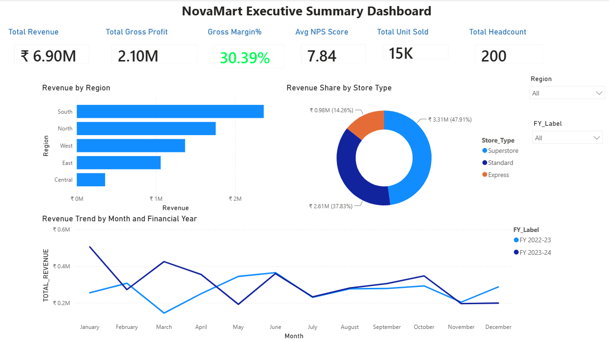

# NovaMart Retail Analytics – Power BI

## 📊 Project Overview

NovaMart Retail Analytics is an end-to-end Power BI project designed to analyze the performance of a fictional retail business across multiple stores, product categories, regions, employees, and customer feedback.

The project transforms raw retail data into an interactive six-page dashboard covering executive performance, store operations, product profitability, workforce analytics, customer satisfaction, and target achievement.

---

## 🛠️ Tools & Technologies

- Power BI Desktop
- Power Query
- DAX
- Microsoft Excel
- Data Modeling
- Data Visualization

---

## 📈 Dashboard Pages

### 1. Executive Summary

Provides a high-level view of overall business performance using KPIs such as Total Revenue, Gross Profit, Gross Margin %, Average NPS Score, Units Sold, and Headcount.

### 2. Store Performance

Analyzes revenue across stores, regions, states, store types, and product categories. It also explores the relationship between store size and revenue per square foot.

### 3. Product Profitability

Examines revenue, gross profit, gross margin, discounts, category performance, and sub-category contribution to identify the most profitable areas of the business.

### 4. Workforce Analytics

Provides insights into employee headcount, compensation, performance ratings, gender distribution, education levels, departments, and regional workforce distribution.

### 5. Customer Satisfaction

Analyzes customer feedback using NPS scores, recommendation behavior, store-level performance, feedback dimensions, geographic patterns, and monthly trends.

### 6. Target vs Actual

Compares actual revenue against business targets across stores, categories, and months, highlighting target achievement percentages and revenue variance.

---

## 🔍 Key Insights

- Overall gross margin is approximately **30%**.
- Superstores contribute the largest share of overall revenue.
- Revenue performance varies considerably across regions and individual stores.
- Clothing records the highest gross margin among the analyzed product categories.
- Store size does not necessarily translate into higher revenue per square foot.
- Customer NPS performance varies across stores and shows changes across survey periods.
- Overall target achievement is approximately **99.6%**, indicating that actual performance is very close to the planned target.

---

## 📁 Repository Contents

| File / Folder | Description |
|---|---|
| `NovaMart.pbix` | Complete Power BI dashboard |
| `NovaMart_Dataset.xlsx` | Dataset used for the analysis |
| `NovaMart_Retail_Analytics_PowerBI_Report.docx` | Detailed project report |
| `Dashboard_Screenshots/` | Screenshots of all six dashboard pages |

---

## 🎯 Project Objective

The objective of this project was to build a complete retail business intelligence solution and demonstrate skills in data preparation, data modeling, KPI development, analytical thinking, and interactive dashboard design using Power BI.

---

## 📌 Dashboard Highlights

**6 Interactive Dashboard Pages • Retail KPI Analysis • Store Performance • Product Profitability • Workforce Analytics • Customer Insights • Target Tracking**

---

### Author

**Sneha P**

*Data Analytics Portfolio Project*
